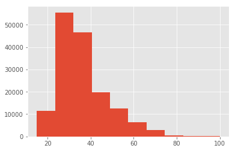
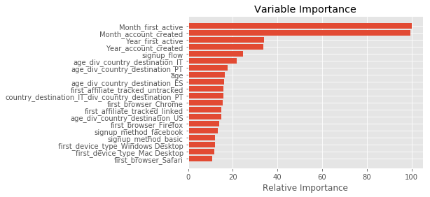

## AirBnB、ユーザが最初に訪れる国名の予測

Basic Course - Day2: Takao Ishikawa


```python
%matplotlib inline
import numpy as np
import pandas as pd
import matplotlib
import matplotlib.pyplot as plt
matplotlib.style.use("ggplot")
from sklearn.ensemble import RandomForestClassifier
from sklearn.cross_validation import KFold
```

    C:\Users\takao\Anaconda3\lib\site-packages\sklearn\cross_validation.py:44: DeprecationWarning: This module was deprecated in version 0.18 in favor of the model_selection module into which all the refactored classes and functions are moved. Also note that the interface of the new CV iterators are different from that of this module. This module will be removed in 0.20.
      "This module will be removed in 0.20.", DeprecationWarning)
    


```python
age_gender_data = pd.read_csv("Airbnb/age_gender_bkts.csv")
country_data = pd.read_csv("Airbnb/countries.csv")
# session_data = pd.read_csv("Airbnb/sessions.csv")
# smp_submission_data = pd.read_csv("Airbnb/sample_submission_NDF.csv")
test = pd.read_csv("Airbnb/test_users.csv")
train = pd.read_csv("Airbnb/train_users_2.csv")
```

## TrainとTestデータの結合


```python
# 識別列を追加した上で、TrainとTestデータを結合
test["country_destination"] = np.nan
test["source"] = "test"
train["source"] = "train"
whole = pd.concat([train, test], axis=0)
whole.shape
```


    (275547, 17)


```python
# 欠損値検査
whole.count()
```


    id                         275547
    date_account_created       275547
    timestamp_first_active     275547
    date_first_booking          88908
    gender                     275547
    age                        158681
    signup_method              275547
    signup_flow                275547
    language                   275547
    affiliate_channel          275547
    affiliate_provider         275547
    first_affiliate_tracked    269462
    signup_app                 275547
    first_device_type          275547
    first_browser              275547
    country_destination        213451
    source                     275547
    dtype: int64


```python
# Genderの中身精査
whole.gender.value_counts()
  # genderがunknownのデータは全体の半分、これらは処理をせずに独立の変数として扱う
  # genderが"OTHER"のグループは334件と少ないので、unknownとして扱う方針とする（処理は別途）
```


    -unknown-    129480
    FEMALE        77524
    MALE          68209
    OTHER           334
    Name: gender, dtype: int64


```python
# age_gender_dataとの結合に備えて、whole["gender"]のnotationを変更する
def change_gender_notation(x):
    if x == "FEMALE":
        return "female"
    elif x == "MALE":
        return "male"
    elif x == "OTHER":
        return "-unknown-"
    elif x == "-unknown-":
        return "-unknown-"
```


```python
whole["gender"] = whole["gender"].apply(change_gender_notation)
```


```python
# Ageのデータクリーニング
whole.age.describe()
```


    count    158681.000000
    mean         47.145310
    std         142.629468
    min           1.000000
    25%          28.000000
    50%          33.000000
    75%          42.000000
    max        2014.000000
    Name: age, dtype: float64


```python
# 明らかな異常値を、まずnullに置き換える。## 一連のnull置き換えを実施したのちに、medianで処理する方針
whole.loc[whole["age"] >= 2000, "age"]= np.nan
whole.loc[whole["age"] < 10, "age"] = np.nan
```


```python
# 西暦年をageに入っているものは、2014から引き算をして、年齢を算出
whole[whole["age"] > 1900].head()
```


<div>
<style>
    .dataframe thead tr:only-child th {
        text-align: right;
    }

    .dataframe thead th {
        text-align: left;
    }

    .dataframe tbody tr th {
        vertical-align: top;
    }
</style>
<table border="1" class="dataframe">
  <thead>
    <tr style="text-align: right;">
      <th></th>
      <th>id</th>
      <th>date_account_created</th>
      <th>timestamp_first_active</th>
      <th>date_first_booking</th>
      <th>gender</th>
      <th>age</th>
      <th>signup_method</th>
      <th>signup_flow</th>
      <th>language</th>
      <th>affiliate_channel</th>
      <th>affiliate_provider</th>
      <th>first_affiliate_tracked</th>
      <th>signup_app</th>
      <th>first_device_type</th>
      <th>first_browser</th>
      <th>country_destination</th>
      <th>source</th>
    </tr>
  </thead>
  <tbody>
    <tr>
      <th>41046</th>
      <td>rm0p78riic</td>
      <td>2012-09-15</td>
      <td>20120915182743</td>
      <td>2012-09-16</td>
      <td>female</td>
      <td>1949.0</td>
      <td>facebook</td>
      <td>12</td>
      <td>en</td>
      <td>api</td>
      <td>other</td>
      <td>untracked</td>
      <td>Moweb</td>
      <td>Windows Desktop</td>
      <td>Chrome</td>
      <td>US</td>
      <td>train</td>
    </tr>
    <tr>
      <th>55474</th>
      <td>lxfw8qaa2e</td>
      <td>2013-01-11</td>
      <td>20130111014721</td>
      <td>NaN</td>
      <td>male</td>
      <td>1931.0</td>
      <td>basic</td>
      <td>0</td>
      <td>en</td>
      <td>direct</td>
      <td>direct</td>
      <td>untracked</td>
      <td>Web</td>
      <td>Windows Desktop</td>
      <td>IE</td>
      <td>NDF</td>
      <td>train</td>
    </tr>
    <tr>
      <th>59537</th>
      <td>lkgth08quo</td>
      <td>2013-02-07</td>
      <td>20130207231010</td>
      <td>2013-02-08</td>
      <td>male</td>
      <td>1932.0</td>
      <td>facebook</td>
      <td>12</td>
      <td>en</td>
      <td>api</td>
      <td>other</td>
      <td>untracked</td>
      <td>Moweb</td>
      <td>iPhone</td>
      <td>-unknown-</td>
      <td>US</td>
      <td>train</td>
    </tr>
    <tr>
      <th>67223</th>
      <td>n87aqj7mf0</td>
      <td>2013-03-25</td>
      <td>20130325205715</td>
      <td>NaN</td>
      <td>male</td>
      <td>1932.0</td>
      <td>facebook</td>
      <td>12</td>
      <td>en</td>
      <td>api</td>
      <td>other</td>
      <td>untracked</td>
      <td>Moweb</td>
      <td>Windows Desktop</td>
      <td>Chrome</td>
      <td>NDF</td>
      <td>train</td>
    </tr>
    <tr>
      <th>67610</th>
      <td>nc8fk6z69z</td>
      <td>2013-03-27</td>
      <td>20130327211209</td>
      <td>2013-04-23</td>
      <td>male</td>
      <td>1932.0</td>
      <td>facebook</td>
      <td>0</td>
      <td>en</td>
      <td>sem-non-brand</td>
      <td>google</td>
      <td>omg</td>
      <td>Web</td>
      <td>Windows Desktop</td>
      <td>Chrome</td>
      <td>US</td>
      <td>train</td>
    </tr>
  </tbody>
</table>
</div>


```python
# 1900を超えているものは、誕生年とみなして、2014年時点の年齢を計算
def age_correct(x):
    if x > 1900.0:
        y = 2014.0 - x
        return y
    else:
        return x
```


```python
whole["age"] = whole["age"].apply(age_correct)
```


```python
# ageの統計量を見て、最大値が適正かを確認 --- 上記の計算の結果 100歳を超える年齢が表出
whole.age.describe()
```


    count    157865.000000
    mean         36.895322
    std          13.848966
    min          15.000000
    25%          28.000000
    50%          33.000000
    75%          42.000000
    max         150.000000
    Name: age, dtype: float64


```python
# （実際はいるかもしれないが）100歳を超える年齢は異常値とみなして、再びnanに置換
whole.loc[whole["age"] > 100, "age"] = np.nan
```


```python
whole["age"].hist() #これで大丈夫そう
```


    <matplotlib.axes._subplots.AxesSubplot at 0x192ea26b710>





```python
# ageのnullの数をカウント
sum(whole["age"].isnull())
```


    119544


```python
# ageのnullを中央値に変換  --- nullが119544件あるので、中央値で置き換えるのは戸惑うが、ほかに手がないので置換実行～
whole["age"] = whole["age"].fillna(whole.age.median())
```


```python
print("whole records:", whole["age"].count(), "missing_records:", sum(whole["age"].isnull()))
```

    whole records: 275547 missing_records: 0
    

## Age_gender_dataのデータ加工


```python
age_gender_data.head()
```


<div>
<style>
    .dataframe thead tr:only-child th {
        text-align: right;
    }

    .dataframe thead th {
        text-align: left;
    }

    .dataframe tbody tr th {
        vertical-align: top;
    }
</style>
<table border="1" class="dataframe">
  <thead>
    <tr style="text-align: right;">
      <th></th>
      <th>age_bucket</th>
      <th>country_destination</th>
      <th>gender</th>
      <th>population_in_thousands</th>
      <th>year</th>
    </tr>
  </thead>
  <tbody>
    <tr>
      <th>0</th>
      <td>100+</td>
      <td>AU</td>
      <td>male</td>
      <td>1.0</td>
      <td>2015.0</td>
    </tr>
    <tr>
      <th>1</th>
      <td>95-99</td>
      <td>AU</td>
      <td>male</td>
      <td>9.0</td>
      <td>2015.0</td>
    </tr>
    <tr>
      <th>2</th>
      <td>90-94</td>
      <td>AU</td>
      <td>male</td>
      <td>47.0</td>
      <td>2015.0</td>
    </tr>
    <tr>
      <th>3</th>
      <td>85-89</td>
      <td>AU</td>
      <td>male</td>
      <td>118.0</td>
      <td>2015.0</td>
    </tr>
    <tr>
      <th>4</th>
      <td>80-84</td>
      <td>AU</td>
      <td>male</td>
      <td>199.0</td>
      <td>2015.0</td>
    </tr>
  </tbody>
</table>
</div>


```python
# yearのカラムは不要なので削除
age_gender_data = age_gender_data.drop('year', axis=1)
```


```python
# population_in_thousandsを横持ちにするために、まずcountry_destinationをダミー変数に置換
age_gender_data = pd.get_dummies(data = age_gender_data, columns = ["country_destination"])
age_gender_data.head()
```


<div>
<style>
    .dataframe thead tr:only-child th {
        text-align: right;
    }

    .dataframe thead th {
        text-align: left;
    }

    .dataframe tbody tr th {
        vertical-align: top;
    }
</style>
<table border="1" class="dataframe">
  <thead>
    <tr style="text-align: right;">
      <th></th>
      <th>age_bucket</th>
      <th>gender</th>
      <th>population_in_thousands</th>
      <th>country_destination_AU</th>
      <th>country_destination_CA</th>
      <th>country_destination_DE</th>
      <th>country_destination_ES</th>
      <th>country_destination_FR</th>
      <th>country_destination_GB</th>
      <th>country_destination_IT</th>
      <th>country_destination_NL</th>
      <th>country_destination_PT</th>
      <th>country_destination_US</th>
    </tr>
  </thead>
  <tbody>
    <tr>
      <th>0</th>
      <td>100+</td>
      <td>male</td>
      <td>1.0</td>
      <td>1</td>
      <td>0</td>
      <td>0</td>
      <td>0</td>
      <td>0</td>
      <td>0</td>
      <td>0</td>
      <td>0</td>
      <td>0</td>
      <td>0</td>
    </tr>
    <tr>
      <th>1</th>
      <td>95-99</td>
      <td>male</td>
      <td>9.0</td>
      <td>1</td>
      <td>0</td>
      <td>0</td>
      <td>0</td>
      <td>0</td>
      <td>0</td>
      <td>0</td>
      <td>0</td>
      <td>0</td>
      <td>0</td>
    </tr>
    <tr>
      <th>2</th>
      <td>90-94</td>
      <td>male</td>
      <td>47.0</td>
      <td>1</td>
      <td>0</td>
      <td>0</td>
      <td>0</td>
      <td>0</td>
      <td>0</td>
      <td>0</td>
      <td>0</td>
      <td>0</td>
      <td>0</td>
    </tr>
    <tr>
      <th>3</th>
      <td>85-89</td>
      <td>male</td>
      <td>118.0</td>
      <td>1</td>
      <td>0</td>
      <td>0</td>
      <td>0</td>
      <td>0</td>
      <td>0</td>
      <td>0</td>
      <td>0</td>
      <td>0</td>
      <td>0</td>
    </tr>
    <tr>
      <th>4</th>
      <td>80-84</td>
      <td>male</td>
      <td>199.0</td>
      <td>1</td>
      <td>0</td>
      <td>0</td>
      <td>0</td>
      <td>0</td>
      <td>0</td>
      <td>0</td>
      <td>0</td>
      <td>0</td>
      <td>0</td>
    </tr>
  </tbody>
</table>
</div>


```python
# Population_in_thousandsをダミー変数にかける
extract_cols = age_gender_data.columns[3:]
```


```python
for col in extract_cols:
    age_gender_data[col] = age_gender_data[col] * age_gender_data['population_in_thousands']
```


```python
# 無駄な行があるので、レコード集計を実施
age_gender_data = age_gender_data.groupby(["age_bucket", "gender"]).sum().reset_index()
age_gender_data.head()
```


<div>
<style>
    .dataframe thead tr:only-child th {
        text-align: right;
    }

    .dataframe thead th {
        text-align: left;
    }

    .dataframe tbody tr th {
        vertical-align: top;
    }
</style>
<table border="1" class="dataframe">
  <thead>
    <tr style="text-align: right;">
      <th></th>
      <th>age_bucket</th>
      <th>gender</th>
      <th>population_in_thousands</th>
      <th>country_destination_AU</th>
      <th>country_destination_CA</th>
      <th>country_destination_DE</th>
      <th>country_destination_ES</th>
      <th>country_destination_FR</th>
      <th>country_destination_GB</th>
      <th>country_destination_IT</th>
      <th>country_destination_NL</th>
      <th>country_destination_PT</th>
      <th>country_destination_US</th>
    </tr>
  </thead>
  <tbody>
    <tr>
      <th>0</th>
      <td>0-4</td>
      <td>female</td>
      <td>20861.0</td>
      <td>781.0</td>
      <td>991.0</td>
      <td>1713.0</td>
      <td>1198.0</td>
      <td>1938.0</td>
      <td>1888.0</td>
      <td>1383.0</td>
      <td>438.0</td>
      <td>225.0</td>
      <td>10306.0</td>
    </tr>
    <tr>
      <th>1</th>
      <td>0-4</td>
      <td>male</td>
      <td>21925.0</td>
      <td>824.0</td>
      <td>1045.0</td>
      <td>1811.0</td>
      <td>1272.0</td>
      <td>2035.0</td>
      <td>1981.0</td>
      <td>1468.0</td>
      <td>462.0</td>
      <td>239.0</td>
      <td>10788.0</td>
    </tr>
    <tr>
      <th>2</th>
      <td>10-14</td>
      <td>female</td>
      <td>20640.0</td>
      <td>707.0</td>
      <td>929.0</td>
      <td>1800.0</td>
      <td>1124.0</td>
      <td>1894.0</td>
      <td>1690.0</td>
      <td>1388.0</td>
      <td>493.0</td>
      <td>269.0</td>
      <td>10346.0</td>
    </tr>
    <tr>
      <th>3</th>
      <td>10-14</td>
      <td>male</td>
      <td>21604.0</td>
      <td>743.0</td>
      <td>983.0</td>
      <td>1892.0</td>
      <td>1189.0</td>
      <td>1985.0</td>
      <td>1771.0</td>
      <td>1468.0</td>
      <td>517.0</td>
      <td>285.0</td>
      <td>10771.0</td>
    </tr>
    <tr>
      <th>4</th>
      <td>100+</td>
      <td>female</td>
      <td>145.0</td>
      <td>4.0</td>
      <td>7.0</td>
      <td>14.0</td>
      <td>9.0</td>
      <td>19.0</td>
      <td>13.0</td>
      <td>15.0</td>
      <td>2.0</td>
      <td>1.0</td>
      <td>61.0</td>
    </tr>
  </tbody>
</table>
</div>


```python
# gender -unknown- にぶつける行を作るため、genderのカラムをdropしたテーブルを作る
age_gender_data_mod = age_gender_data.drop('gender', axis=1)
```


```python
# age_bucketのみでgroupbyを実行
age_gender_data_mod = age_gender_data_mod.groupby(["age_bucket"]).sum().reset_index()
```


```python
# 作成したデータに、unknownの値を持つgender列を作成
age_gender_data_mod["gender"] = "-unknown-"
```


```python
# female/male毎に集計した先ほどのデータにunionする
age_gender_data = pd.concat([age_gender_data, age_gender_data_mod], axis=0)   #[ ] を忘れないこと~ 
```

## wholeデータとage_gender_dataの結合


```python
whole.head()
```


<div>
<style>
    .dataframe thead tr:only-child th {
        text-align: right;
    }

    .dataframe thead th {
        text-align: left;
    }

    .dataframe tbody tr th {
        vertical-align: top;
    }
</style>
<table border="1" class="dataframe">
  <thead>
    <tr style="text-align: right;">
      <th></th>
      <th>id</th>
      <th>date_account_created</th>
      <th>timestamp_first_active</th>
      <th>date_first_booking</th>
      <th>gender</th>
      <th>age</th>
      <th>signup_method</th>
      <th>signup_flow</th>
      <th>language</th>
      <th>affiliate_channel</th>
      <th>affiliate_provider</th>
      <th>first_affiliate_tracked</th>
      <th>signup_app</th>
      <th>first_device_type</th>
      <th>first_browser</th>
      <th>country_destination</th>
      <th>source</th>
    </tr>
  </thead>
  <tbody>
    <tr>
      <th>0</th>
      <td>gxn3p5htnn</td>
      <td>2010-06-28</td>
      <td>20090319043255</td>
      <td>NaN</td>
      <td>-unknown-</td>
      <td>33.0</td>
      <td>facebook</td>
      <td>0</td>
      <td>en</td>
      <td>direct</td>
      <td>direct</td>
      <td>untracked</td>
      <td>Web</td>
      <td>Mac Desktop</td>
      <td>Chrome</td>
      <td>NDF</td>
      <td>train</td>
    </tr>
    <tr>
      <th>1</th>
      <td>820tgsjxq7</td>
      <td>2011-05-25</td>
      <td>20090523174809</td>
      <td>NaN</td>
      <td>male</td>
      <td>38.0</td>
      <td>facebook</td>
      <td>0</td>
      <td>en</td>
      <td>seo</td>
      <td>google</td>
      <td>untracked</td>
      <td>Web</td>
      <td>Mac Desktop</td>
      <td>Chrome</td>
      <td>NDF</td>
      <td>train</td>
    </tr>
    <tr>
      <th>2</th>
      <td>4ft3gnwmtx</td>
      <td>2010-09-28</td>
      <td>20090609231247</td>
      <td>2010-08-02</td>
      <td>female</td>
      <td>56.0</td>
      <td>basic</td>
      <td>3</td>
      <td>en</td>
      <td>direct</td>
      <td>direct</td>
      <td>untracked</td>
      <td>Web</td>
      <td>Windows Desktop</td>
      <td>IE</td>
      <td>US</td>
      <td>train</td>
    </tr>
    <tr>
      <th>3</th>
      <td>bjjt8pjhuk</td>
      <td>2011-12-05</td>
      <td>20091031060129</td>
      <td>2012-09-08</td>
      <td>female</td>
      <td>42.0</td>
      <td>facebook</td>
      <td>0</td>
      <td>en</td>
      <td>direct</td>
      <td>direct</td>
      <td>untracked</td>
      <td>Web</td>
      <td>Mac Desktop</td>
      <td>Firefox</td>
      <td>other</td>
      <td>train</td>
    </tr>
    <tr>
      <th>4</th>
      <td>87mebub9p4</td>
      <td>2010-09-14</td>
      <td>20091208061105</td>
      <td>2010-02-18</td>
      <td>-unknown-</td>
      <td>41.0</td>
      <td>basic</td>
      <td>0</td>
      <td>en</td>
      <td>direct</td>
      <td>direct</td>
      <td>untracked</td>
      <td>Web</td>
      <td>Mac Desktop</td>
      <td>Chrome</td>
      <td>US</td>
      <td>train</td>
    </tr>
  </tbody>
</table>
</div>


```python
set(age_gender_data["age_bucket"])
```


    {'0-4',
     '10-14',
     '100+',
     '15-19',
     '20-24',
     '25-29',
     '30-34',
     '35-39',
     '40-44',
     '45-49',
     '5-9',
     '50-54',
     '55-59',
     '60-64',
     '65-69',
     '70-74',
     '75-79',
     '80-84',
     '85-89',
     '90-94',
     '95-99'}


```python
# age_genderデータのage_bucketは扱いづらいので、min値を取り出して、新しいカラムを作る
def get_left_num(x):
    x_len = len(x)
    if x_len ==3:
        return int(x[0])
    elif x_len == 5:
        return int(x[:2])
    elif x_len == 4:
        return int(x[:3]) + 1
    else:
        return 999
```


```python
age_gender_data["age_min_key"] = age_gender_data["age_bucket"].apply(get_left_num)
```


```python
age_gender_data.head()
```


<div>
<style>
    .dataframe thead tr:only-child th {
        text-align: right;
    }

    .dataframe thead th {
        text-align: left;
    }

    .dataframe tbody tr th {
        vertical-align: top;
    }
</style>
<table border="1" class="dataframe">
  <thead>
    <tr style="text-align: right;">
      <th></th>
      <th>age_bucket</th>
      <th>country_destination_AU</th>
      <th>country_destination_CA</th>
      <th>country_destination_DE</th>
      <th>country_destination_ES</th>
      <th>country_destination_FR</th>
      <th>country_destination_GB</th>
      <th>country_destination_IT</th>
      <th>country_destination_NL</th>
      <th>country_destination_PT</th>
      <th>country_destination_US</th>
      <th>gender</th>
      <th>population_in_thousands</th>
      <th>age_min_key</th>
    </tr>
  </thead>
  <tbody>
    <tr>
      <th>0</th>
      <td>0-4</td>
      <td>781.0</td>
      <td>991.0</td>
      <td>1713.0</td>
      <td>1198.0</td>
      <td>1938.0</td>
      <td>1888.0</td>
      <td>1383.0</td>
      <td>438.0</td>
      <td>225.0</td>
      <td>10306.0</td>
      <td>female</td>
      <td>20861.0</td>
      <td>0</td>
    </tr>
    <tr>
      <th>1</th>
      <td>0-4</td>
      <td>824.0</td>
      <td>1045.0</td>
      <td>1811.0</td>
      <td>1272.0</td>
      <td>2035.0</td>
      <td>1981.0</td>
      <td>1468.0</td>
      <td>462.0</td>
      <td>239.0</td>
      <td>10788.0</td>
      <td>male</td>
      <td>21925.0</td>
      <td>0</td>
    </tr>
    <tr>
      <th>2</th>
      <td>10-14</td>
      <td>707.0</td>
      <td>929.0</td>
      <td>1800.0</td>
      <td>1124.0</td>
      <td>1894.0</td>
      <td>1690.0</td>
      <td>1388.0</td>
      <td>493.0</td>
      <td>269.0</td>
      <td>10346.0</td>
      <td>female</td>
      <td>20640.0</td>
      <td>10</td>
    </tr>
    <tr>
      <th>3</th>
      <td>10-14</td>
      <td>743.0</td>
      <td>983.0</td>
      <td>1892.0</td>
      <td>1189.0</td>
      <td>1985.0</td>
      <td>1771.0</td>
      <td>1468.0</td>
      <td>517.0</td>
      <td>285.0</td>
      <td>10771.0</td>
      <td>male</td>
      <td>21604.0</td>
      <td>10</td>
    </tr>
    <tr>
      <th>4</th>
      <td>100+</td>
      <td>4.0</td>
      <td>7.0</td>
      <td>14.0</td>
      <td>9.0</td>
      <td>19.0</td>
      <td>13.0</td>
      <td>15.0</td>
      <td>2.0</td>
      <td>1.0</td>
      <td>61.0</td>
      <td>female</td>
      <td>145.0</td>
      <td>101</td>
    </tr>
  </tbody>
</table>
</div>


```python
# 今度は、wholeに対して、age_min_keyを作成する
val_list = np.unique(age_gender_data["age_min_key"])  ##searchsortedの引数に、setが使えなかったので、np.uniqueを使った
```


```python
arr = np.array(val_list)
```


```python
whole["age_min_key"] = arr[arr.searchsorted(whole["age"])-1] 
# searchsortedはインデックスを返すので、arrの中の添え字にして値を取り出す
```


```python
whole.head()
whole.shape
```


    (275547, 18)


```python
# genderと、上記で作成したage_min_keyを軸にして、age_gender_dataとwholeを結合
whole = pd.merge(whole, age_gender_data, on=['age_min_key', 'gender'], how='left')
```


```python
whole.head()
```


<div>
<style>
    .dataframe thead tr:only-child th {
        text-align: right;
    }

    .dataframe thead th {
        text-align: left;
    }

    .dataframe tbody tr th {
        vertical-align: top;
    }
</style>
<table border="1" class="dataframe">
  <thead>
    <tr style="text-align: right;">
      <th></th>
      <th>id</th>
      <th>date_account_created</th>
      <th>timestamp_first_active</th>
      <th>date_first_booking</th>
      <th>gender</th>
      <th>age</th>
      <th>signup_method</th>
      <th>signup_flow</th>
      <th>language</th>
      <th>affiliate_channel</th>
      <th>...</th>
      <th>country_destination_CA</th>
      <th>country_destination_DE</th>
      <th>country_destination_ES</th>
      <th>country_destination_FR</th>
      <th>country_destination_GB</th>
      <th>country_destination_IT</th>
      <th>country_destination_NL</th>
      <th>country_destination_PT</th>
      <th>country_destination_US</th>
      <th>population_in_thousands</th>
    </tr>
  </thead>
  <tbody>
    <tr>
      <th>0</th>
      <td>gxn3p5htnn</td>
      <td>2010-06-28</td>
      <td>20090319043255</td>
      <td>NaN</td>
      <td>-unknown-</td>
      <td>33.0</td>
      <td>facebook</td>
      <td>0</td>
      <td>en</td>
      <td>direct</td>
      <td>...</td>
      <td>2502.0</td>
      <td>5198.0</td>
      <td>3394.0</td>
      <td>4081.0</td>
      <td>4302.0</td>
      <td>3605.0</td>
      <td>1000.0</td>
      <td>733.0</td>
      <td>21847.0</td>
      <td>48408.0</td>
    </tr>
    <tr>
      <th>1</th>
      <td>820tgsjxq7</td>
      <td>2011-05-25</td>
      <td>20090523174809</td>
      <td>NaN</td>
      <td>male</td>
      <td>38.0</td>
      <td>facebook</td>
      <td>0</td>
      <td>en</td>
      <td>seo</td>
      <td>...</td>
      <td>1189.0</td>
      <td>2448.0</td>
      <td>2117.0</td>
      <td>1842.0</td>
      <td>1979.0</td>
      <td>2117.0</td>
      <td>490.0</td>
      <td>419.0</td>
      <td>10329.0</td>
      <td>23727.0</td>
    </tr>
    <tr>
      <th>2</th>
      <td>4ft3gnwmtx</td>
      <td>2010-09-28</td>
      <td>20090609231247</td>
      <td>2010-08-02</td>
      <td>female</td>
      <td>56.0</td>
      <td>basic</td>
      <td>3</td>
      <td>en</td>
      <td>direct</td>
      <td>...</td>
      <td>1305.0</td>
      <td>2996.0</td>
      <td>1531.0</td>
      <td>2125.0</td>
      <td>1991.0</td>
      <td>2069.0</td>
      <td>580.0</td>
      <td>366.0</td>
      <td>11264.0</td>
      <td>24966.0</td>
    </tr>
    <tr>
      <th>3</th>
      <td>bjjt8pjhuk</td>
      <td>2011-12-05</td>
      <td>20091031060129</td>
      <td>2012-09-08</td>
      <td>female</td>
      <td>42.0</td>
      <td>facebook</td>
      <td>0</td>
      <td>en</td>
      <td>direct</td>
      <td>...</td>
      <td>1169.0</td>
      <td>2559.0</td>
      <td>1924.0</td>
      <td>2231.0</td>
      <td>2147.0</td>
      <td>2411.0</td>
      <td>583.0</td>
      <td>418.0</td>
      <td>10308.0</td>
      <td>24588.0</td>
    </tr>
    <tr>
      <th>4</th>
      <td>87mebub9p4</td>
      <td>2010-09-14</td>
      <td>20091208061105</td>
      <td>2010-02-18</td>
      <td>-unknown-</td>
      <td>41.0</td>
      <td>basic</td>
      <td>0</td>
      <td>en</td>
      <td>direct</td>
      <td>...</td>
      <td>2348.0</td>
      <td>5192.0</td>
      <td>3976.0</td>
      <td>4443.0</td>
      <td>4248.0</td>
      <td>4839.0</td>
      <td>1165.0</td>
      <td>834.0</td>
      <td>20467.0</td>
      <td>49170.0</td>
    </tr>
  </tbody>
</table>
<p>5 rows × 30 columns</p>
</div>


```python
whole.columns
```


    Index(['id', 'date_account_created', 'timestamp_first_active',
           'date_first_booking', 'gender', 'age', 'signup_method', 'signup_flow',
           'language', 'affiliate_channel', 'affiliate_provider',
           'first_affiliate_tracked', 'signup_app', 'first_device_type',
           'first_browser', 'country_destination', 'source', 'age_min_key',
           'age_bucket', 'country_destination_AU', 'country_destination_CA',
           'country_destination_DE', 'country_destination_ES',
           'country_destination_FR', 'country_destination_GB',
           'country_destination_IT', 'country_destination_NL',
           'country_destination_PT', 'country_destination_US',
           'population_in_thousands'],
          dtype='object')


```python
# country_destination_XXには、訪問者数が絶対値で入っているので、行当たりのトータルが100%になるように、population_in_thousandsで割る
tgt_countries = ['country_destination_AU', 'country_destination_CA','country_destination_DE', 
                 'country_destination_ES', 'country_destination_FR', 'country_destination_GB', 
                 'country_destination_IT', 'country_destination_NL','country_destination_PT', 'country_destination_US']
```


```python
for col in tgt_countries:
    whole[col] = whole[col] / whole["population_in_thousands"]
```


```python
# population_in_thousandsは役割を終えたので、dropする
whole = whole.drop('population_in_thousands', axis=1)
```

## ログデータは、利活用しないこととした
ログデータのうち、google_translateの起動有無を特徴量として抽出しようと考えたが、対象userが69人のみだったので実施せず

## Countryデータの整形・結合


```python
country_data.head()
```


<div>
<style>
    .dataframe thead tr:only-child th {
        text-align: right;
    }

    .dataframe thead th {
        text-align: left;
    }

    .dataframe tbody tr th {
        vertical-align: top;
    }
</style>
<table border="1" class="dataframe">
  <thead>
    <tr style="text-align: right;">
      <th></th>
      <th>country_destination</th>
      <th>lat_destination</th>
      <th>lng_destination</th>
      <th>distance_km</th>
      <th>destination_km2</th>
      <th>destination_language</th>
      <th>language_levenshtein_distance</th>
    </tr>
  </thead>
  <tbody>
    <tr>
      <th>0</th>
      <td>AU</td>
      <td>-26.853388</td>
      <td>133.275160</td>
      <td>15297.7440</td>
      <td>7741220.0</td>
      <td>eng</td>
      <td>0.00</td>
    </tr>
    <tr>
      <th>1</th>
      <td>CA</td>
      <td>62.393303</td>
      <td>-96.818146</td>
      <td>2828.1333</td>
      <td>9984670.0</td>
      <td>eng</td>
      <td>0.00</td>
    </tr>
    <tr>
      <th>2</th>
      <td>DE</td>
      <td>51.165707</td>
      <td>10.452764</td>
      <td>7879.5680</td>
      <td>357022.0</td>
      <td>deu</td>
      <td>72.61</td>
    </tr>
    <tr>
      <th>3</th>
      <td>ES</td>
      <td>39.896027</td>
      <td>-2.487694</td>
      <td>7730.7240</td>
      <td>505370.0</td>
      <td>spa</td>
      <td>92.25</td>
    </tr>
    <tr>
      <th>4</th>
      <td>FR</td>
      <td>46.232193</td>
      <td>2.209667</td>
      <td>7682.9450</td>
      <td>643801.0</td>
      <td>fra</td>
      <td>92.06</td>
    </tr>
  </tbody>
</table>
</div>


```python
# userの母国語が、行き先の国の言語とマッチしているかをフラグ化する。
# まずは、wholeとcountry_dataの中の言語のnotationの違いを補正
lan_conv = {
    'deu':'de',
    'eng':'en',
    'fra':'fr',
    'ita':'it',
    'nld':'nl',
    'por':'pt',
    'spa':'es'
}
```


```python
country_data["language"] = country_data["destination_language "].map(lan_conv)
```


```python
# wholeのテーブルに、それぞれのcountryのカラムを作り、値をその言語とする
country = np.array(country_data["country_destination"])
language = np.array(country_data["language"])
```


```python
for i in range(len(country)):
    whole[country[i]] = language[i]
```


```python
whole.head()
```


<div>
<style>
    .dataframe thead tr:only-child th {
        text-align: right;
    }

    .dataframe thead th {
        text-align: left;
    }

    .dataframe tbody tr th {
        vertical-align: top;
    }
</style>
<table border="1" class="dataframe">
  <thead>
    <tr style="text-align: right;">
      <th></th>
      <th>id</th>
      <th>date_account_created</th>
      <th>timestamp_first_active</th>
      <th>date_first_booking</th>
      <th>gender</th>
      <th>age</th>
      <th>signup_method</th>
      <th>signup_flow</th>
      <th>language</th>
      <th>affiliate_channel</th>
      <th>...</th>
      <th>AU</th>
      <th>CA</th>
      <th>DE</th>
      <th>ES</th>
      <th>FR</th>
      <th>GB</th>
      <th>IT</th>
      <th>NL</th>
      <th>PT</th>
      <th>US</th>
    </tr>
  </thead>
  <tbody>
    <tr>
      <th>0</th>
      <td>gxn3p5htnn</td>
      <td>2010-06-28</td>
      <td>20090319043255</td>
      <td>NaN</td>
      <td>-unknown-</td>
      <td>33.0</td>
      <td>facebook</td>
      <td>0</td>
      <td>en</td>
      <td>direct</td>
      <td>...</td>
      <td>en</td>
      <td>en</td>
      <td>de</td>
      <td>es</td>
      <td>fr</td>
      <td>en</td>
      <td>it</td>
      <td>nl</td>
      <td>pt</td>
      <td>en</td>
    </tr>
    <tr>
      <th>1</th>
      <td>820tgsjxq7</td>
      <td>2011-05-25</td>
      <td>20090523174809</td>
      <td>NaN</td>
      <td>male</td>
      <td>38.0</td>
      <td>facebook</td>
      <td>0</td>
      <td>en</td>
      <td>seo</td>
      <td>...</td>
      <td>en</td>
      <td>en</td>
      <td>de</td>
      <td>es</td>
      <td>fr</td>
      <td>en</td>
      <td>it</td>
      <td>nl</td>
      <td>pt</td>
      <td>en</td>
    </tr>
    <tr>
      <th>2</th>
      <td>4ft3gnwmtx</td>
      <td>2010-09-28</td>
      <td>20090609231247</td>
      <td>2010-08-02</td>
      <td>female</td>
      <td>56.0</td>
      <td>basic</td>
      <td>3</td>
      <td>en</td>
      <td>direct</td>
      <td>...</td>
      <td>en</td>
      <td>en</td>
      <td>de</td>
      <td>es</td>
      <td>fr</td>
      <td>en</td>
      <td>it</td>
      <td>nl</td>
      <td>pt</td>
      <td>en</td>
    </tr>
    <tr>
      <th>3</th>
      <td>bjjt8pjhuk</td>
      <td>2011-12-05</td>
      <td>20091031060129</td>
      <td>2012-09-08</td>
      <td>female</td>
      <td>42.0</td>
      <td>facebook</td>
      <td>0</td>
      <td>en</td>
      <td>direct</td>
      <td>...</td>
      <td>en</td>
      <td>en</td>
      <td>de</td>
      <td>es</td>
      <td>fr</td>
      <td>en</td>
      <td>it</td>
      <td>nl</td>
      <td>pt</td>
      <td>en</td>
    </tr>
    <tr>
      <th>4</th>
      <td>87mebub9p4</td>
      <td>2010-09-14</td>
      <td>20091208061105</td>
      <td>2010-02-18</td>
      <td>-unknown-</td>
      <td>41.0</td>
      <td>basic</td>
      <td>0</td>
      <td>en</td>
      <td>direct</td>
      <td>...</td>
      <td>en</td>
      <td>en</td>
      <td>de</td>
      <td>es</td>
      <td>fr</td>
      <td>en</td>
      <td>it</td>
      <td>nl</td>
      <td>pt</td>
      <td>en</td>
    </tr>
  </tbody>
</table>
<p>5 rows × 39 columns</p>
</div>


```python
whole.columns
```


    Index(['id', 'date_account_created', 'timestamp_first_active',
           'date_first_booking', 'gender', 'age', 'signup_method', 'signup_flow',
           'language', 'affiliate_channel', 'affiliate_provider',
           'first_affiliate_tracked', 'signup_app', 'first_device_type',
           'first_browser', 'country_destination', 'source', 'age_min_key',
           'age_bucket', 'country_destination_AU', 'country_destination_CA',
           'country_destination_DE', 'country_destination_ES',
           'country_destination_FR', 'country_destination_GB',
           'country_destination_IT', 'country_destination_NL',
           'country_destination_PT', 'country_destination_US', 'AU', 'CA', 'DE',
           'ES', 'FR', 'GB', 'IT', 'NL', 'PT', 'US'],
          dtype='object')


```python
# それぞれのcountryのカラムで、userの母国語とのマッチングをフラグ化する
lang_countries = ['AU', 'CA', 'DE', 'ES', 'FR', 'GB', 'IT', 'NL', 'PT', 'US']
```


```python
for each_lan in lang_countries:
    whole[each_lan] = (whole["language"] == whole[each_lan]) * 1 
```


```python
whole.head()
```


<div>
<style>
    .dataframe thead tr:only-child th {
        text-align: right;
    }

    .dataframe thead th {
        text-align: left;
    }

    .dataframe tbody tr th {
        vertical-align: top;
    }
</style>
<table border="1" class="dataframe">
  <thead>
    <tr style="text-align: right;">
      <th></th>
      <th>id</th>
      <th>date_account_created</th>
      <th>timestamp_first_active</th>
      <th>date_first_booking</th>
      <th>gender</th>
      <th>age</th>
      <th>signup_method</th>
      <th>signup_flow</th>
      <th>language</th>
      <th>affiliate_channel</th>
      <th>...</th>
      <th>AU</th>
      <th>CA</th>
      <th>DE</th>
      <th>ES</th>
      <th>FR</th>
      <th>GB</th>
      <th>IT</th>
      <th>NL</th>
      <th>PT</th>
      <th>US</th>
    </tr>
  </thead>
  <tbody>
    <tr>
      <th>0</th>
      <td>gxn3p5htnn</td>
      <td>2010-06-28</td>
      <td>20090319043255</td>
      <td>NaN</td>
      <td>-unknown-</td>
      <td>33.0</td>
      <td>facebook</td>
      <td>0</td>
      <td>en</td>
      <td>direct</td>
      <td>...</td>
      <td>1</td>
      <td>1</td>
      <td>0</td>
      <td>0</td>
      <td>0</td>
      <td>1</td>
      <td>0</td>
      <td>0</td>
      <td>0</td>
      <td>1</td>
    </tr>
    <tr>
      <th>1</th>
      <td>820tgsjxq7</td>
      <td>2011-05-25</td>
      <td>20090523174809</td>
      <td>NaN</td>
      <td>male</td>
      <td>38.0</td>
      <td>facebook</td>
      <td>0</td>
      <td>en</td>
      <td>seo</td>
      <td>...</td>
      <td>1</td>
      <td>1</td>
      <td>0</td>
      <td>0</td>
      <td>0</td>
      <td>1</td>
      <td>0</td>
      <td>0</td>
      <td>0</td>
      <td>1</td>
    </tr>
    <tr>
      <th>2</th>
      <td>4ft3gnwmtx</td>
      <td>2010-09-28</td>
      <td>20090609231247</td>
      <td>2010-08-02</td>
      <td>female</td>
      <td>56.0</td>
      <td>basic</td>
      <td>3</td>
      <td>en</td>
      <td>direct</td>
      <td>...</td>
      <td>1</td>
      <td>1</td>
      <td>0</td>
      <td>0</td>
      <td>0</td>
      <td>1</td>
      <td>0</td>
      <td>0</td>
      <td>0</td>
      <td>1</td>
    </tr>
    <tr>
      <th>3</th>
      <td>bjjt8pjhuk</td>
      <td>2011-12-05</td>
      <td>20091031060129</td>
      <td>2012-09-08</td>
      <td>female</td>
      <td>42.0</td>
      <td>facebook</td>
      <td>0</td>
      <td>en</td>
      <td>direct</td>
      <td>...</td>
      <td>1</td>
      <td>1</td>
      <td>0</td>
      <td>0</td>
      <td>0</td>
      <td>1</td>
      <td>0</td>
      <td>0</td>
      <td>0</td>
      <td>1</td>
    </tr>
    <tr>
      <th>4</th>
      <td>87mebub9p4</td>
      <td>2010-09-14</td>
      <td>20091208061105</td>
      <td>2010-02-18</td>
      <td>-unknown-</td>
      <td>41.0</td>
      <td>basic</td>
      <td>0</td>
      <td>en</td>
      <td>direct</td>
      <td>...</td>
      <td>1</td>
      <td>1</td>
      <td>0</td>
      <td>0</td>
      <td>0</td>
      <td>1</td>
      <td>0</td>
      <td>0</td>
      <td>0</td>
      <td>1</td>
    </tr>
  </tbody>
</table>
<p>5 rows × 39 columns</p>
</div>


## 特徴量の量産プロセス（とりあえず、たくさん作ってみる）


```python
#date_account_createdから年と月を抽出し特徴量に
whole["Month_account_created"]= whole['date_account_created'].apply(lambda x: int(x[5:7]))
whole["Year_account_created"]= whole['date_account_created'].apply(lambda x: int(x[:4]))

#timestamp_first_activeから年と月を抽出し特徴量に
whole.timestamp_first_active=whole.timestamp_first_active.apply(str)
whole["Month_first_active"]=whole['timestamp_first_active'].apply(lambda x:int(x[4:6]))
whole["Year_first_active"]=whole['timestamp_first_active'].apply(lambda x:int(x[:4]))
```


```python
# gender,signup_method,language~first_browserについて
#カテゴリー変数なので数値に変換
category_columns=["gender","signup_method","language","affiliate_channel","affiliate_provider",
                  "first_affiliate_tracked","signup_app","first_device_type","first_browser"]
whole = pd.get_dummies(whole, columns=category_columns)
```


```python
# auto_feature generation関数の使用に必要なライブラリをインポート
from scipy.stats import spearmanr
from sklearn.cross_validation import train_test_split, KFold
from sklearn.metrics import mean_squared_error
```


```python
# ターゲット変数と、割り算による特徴量生成の対象となるカラムを指定する
target_col = 'country_destination'
feature_cols = ['age', 'country_destination_CA',
       'country_destination_DE', 'country_destination_ES',
       'country_destination_FR', 'country_destination_GB',
       'country_destination_IT', 'country_destination_NL',
       'country_destination_PT', 'country_destination_US',
       'AU', 'CA', 'DE','ES', 'FR', 'GB', 'IT', 'NL', 'PT', 'US']                
```


```python
# 特徴量を割り算で計算
cutoff_r = 0.5
new_added_col = []
for i in range(0, len(feature_cols)-1):
    for j in range(i+1, len(feature_cols)):
        first_col_name = feature_cols[i]
        second_col_name = feature_cols[j]
        r = spearmanr(whole[first_col_name], whole[second_col_name]).correlation
        if abs(r) > cutoff_r:
            new_colname = first_col_name + "_div_" + second_col_name
            whole[new_colname] = whole[first_col_name] / (whole[second_col_name] + 0.01)
            new_added_col.append(new_colname)
```


```python
feature_cols = feature_cols + new_added_col
```


```python
new_added_col
```


    ['age_div_country_destination_ES',
     'age_div_country_destination_IT',
     'age_div_country_destination_PT',
     'age_div_country_destination_US',
     'country_destination_CA_div_country_destination_GB',
     'country_destination_CA_div_country_destination_IT',
     'country_destination_DE_div_country_destination_US',
     'country_destination_ES_div_country_destination_FR',
     'country_destination_ES_div_country_destination_IT',
     'country_destination_ES_div_country_destination_PT',
     'country_destination_ES_div_country_destination_US',
     'country_destination_FR_div_country_destination_NL',
     'country_destination_FR_div_country_destination_PT',
     'country_destination_GB_div_country_destination_IT',
     'country_destination_IT_div_country_destination_PT',
     'country_destination_IT_div_country_destination_US',
     'country_destination_PT_div_country_destination_US',
     'AU_div_CA',
     'AU_div_GB',
     'AU_div_US',
     'CA_div_GB',
     'CA_div_US',
     'GB_div_US']


## wholeをtrainとtestに再分割して、モデリングの準備


```python
# sourceカラムを使って、trainとtestに分割
train=whole[whole.source == 'train']
test=whole[whole.source == 'test']
test_id = test['id'] ##使い道がよくわからないけど、とりあえず、benchmark codeをコピー
```


```python
# train.head(1).T
```


```python
#予測に用いるデータの作成
X_train=train.drop(["id","date_account_created","timestamp_first_active",
                    "date_first_booking","country_destination", "source", 
                    "age_min_key", "age_bucket"],axis=1)
y_train=train.country_destination
```


```python
X_test=test.drop(["id","date_account_created","timestamp_first_active",
                  "date_first_booking","country_destination", "source", 
                  "age_min_key", "age_bucket"],axis=1)
```


```python
train.shape
```


    (213451, 191)


```python
X_train.shape
```


    (213451, 183)


```python
y_train.shape
```


    (213451,)


```python
X_test.shape
```


    (62096, 183)


```python
# Countryの辞書作成
country_unique=list(set(y_train))
country_dict={country_unique[i]:i for i in range(len(country_unique))}
country_dict
```


    {'AU': 6,
     'CA': 3,
     'DE': 5,
     'ES': 0,
     'FR': 9,
     'GB': 1,
     'IT': 2,
     'NDF': 11,
     'NL': 8,
     'PT': 4,
     'US': 10,
     'other': 7}


```python
# countryの辞書をy_trainに充てる
y_train_map=y_train.map(country_dict)
y_train_map[:10]
```


    0    11
    1    11
    2    10
    3     7
    4    10
    5    10
    6    10
    7    10
    8    10
    9    10
    Name: country_destination, dtype: int64


## NDCGの関数を定義する


```python
y_true = 3
y_pred = np.array([5,3,2,1,0])
```


```python
country_idx = sorted(list(country_dict.values()))
country_idx = np.array(country_idx)

def get_dcg(y_pred, y_true):
    dcg5 = (2**(y_pred==y_true).astype(np.float) -1) /np.log2(np.arange(1,len(y_pred)+1)+1)
    return sum(dcg5)

def get_mean_dcg_score(proba_array, y_true):
    dcg_scores = []
    for i in range(len(proba_array)):
        each = proba_array[i]
        top5_idx = country_idx[np.argsort(each)][::-1][:5]  #Top5の国のインデックスを取得
        tmp_dcg = get_dcg(y_pred=top5_idx, y_true=y_true[i])  #DCGのスコアを取得
        dcg_scores.append(tmp_dcg)  #全てのレコードのDCGのスコアを保管
    return np.mean(dcg_scores)
```

テスト:  予測した順番が3,1,2,0 / 正解は3（つまり正しい結果を予測できている）


```python
y_true = np.array([3])
y_pred = np.array([3,1,2,0])
    
get_dcg(y_pred=y_pred, y_true=y_true)
```


    1.0


## クロスバリデーション


```python
# モデリングに入れるためのテーブルをndarrayに変換する
X_train_ar = np.array(X_train)
y_train_map_ar = np.array(y_train_map)
X_test_ar = np.array(X_test)
```


```python
# クロスバリデーション実施
k_fold=KFold(y_train_map_ar.shape[0],5,shuffle=True)
score_list=[]

clf = RandomForestClassifier()

for train_index, test_index in k_fold:
    X1,X2 = X_train_ar[train_index], X_train_ar[test_index]
    Y1,Y2 = y_train_map_ar[train_index], y_train_map_ar[test_index]
    clf.fit(X1, Y1)
    ypred = clf.predict_proba(X2)
    ndcg_score = get_mean_dcg_score(ypred, Y2)
    score_list.append(ndcg_score)
```


```python
print("Mean: ", np.mean(score_list))
print("SD: ", np.std(score_list))
```

    Mean:  0.786424327115
    SD:  0.0012081853144
    

## 変数の重要度確認


```python
def varImpPlot(clf, feature_names, topN = 10, verbose = True):
    feature_names = np.array(feature_names)
    feature_importance = clf.feature_importances_
    feature_importance = 100.0 * (feature_importance / feature_importance.max())
    sorted_idx = np.argsort(feature_importance)
    
    topN_feature = feature_importance[sorted_idx][len(feature_importance) - topN:]
    topN_feature_name = feature_names[sorted_idx][len(feature_importance) - topN:]
    pos = np.arange(topN) + .5
    plt.barh(pos, topN_feature, align='center')
    plt.yticks(pos, topN_feature_name)
    plt.xlabel('Relative Importance')
    plt.title('Variable Importance')
    plt.show()
    
    rev_sorted_idx = np.argsort(feature_importance)[::-1]
    if verbose:
        for i, v in zip(feature_names[rev_sorted_idx], feature_importance[rev_sorted_idx]):
            print(i, v)
```


```python
feature_cols = X_train.columns
```


```python
varImpPlot(clf, feature_cols, topN=20, verbose=False)
```





## 一定の重要度がないものを削除してモデル再構築


```python
feature_importance = clf.feature_importances_
feature_importance = 100.0 * (feature_importance / feature_importance.max())
feature_cols_ar = np.array(feature_cols)
new_feature_cols = feature_cols_ar[feature_importance > 0]
```


```python
print("# of original feature cols:", len(feature_cols), ", # of new feature cols:",len(new_feature_cols))
```

    # of original feature cols: 183 , # of new feature cols: 173
    


```python
#予測に用いるデータの再作成
X_train=train[new_feature_cols]
y_train=train.country_destination
```


```python
X_test=test[new_feature_cols]
```


```python
X_train_ar = np.array(X_train)
y_train_map_ar = np.array(y_train_map)
X_test_ar = np.array(X_test)
```


```python
# クロスバリデーション実施
k_fold=KFold(y_train_map_ar.shape[0],5,shuffle=True)
score_list=[]

clf = RandomForestClassifier()

for train_index, test_index in k_fold:
    X1,X2 = X_train_ar[train_index], X_train_ar[test_index]
    Y1,Y2 = y_train_map_ar[train_index], y_train_map_ar[test_index]
    clf.fit(X1, Y1)
    ypred = clf.predict_proba(X2)
    ndcg_score = get_mean_dcg_score(ypred, Y2)
    score_list.append(ndcg_score)
```


```python
print("Mean: ", np.mean(score_list))
print("SD: ", np.std(score_list))
```

    Mean:  0.786847201476
    SD:  0.00143127416402
    

### うーん、標準偏差は微増したものの、精度が少しばかりあがったので、こちらを採用

## 最終モデルの作成


```python
clf = RandomForestClassifier()
clf.fit(X_train_ar, y_train_map_ar)
ypred_proba = clf.predict_proba(X_test_ar)
```

## Submission Fileを書き出す


```python
# country_dictのKeyとValueを入れ替えた形で辞書を作る
country_dict_reverse={v:k for k,v in country_dict.items()}
country_dict_reverse
```


    {0: 'ES',
     1: 'GB',
     2: 'IT',
     3: 'CA',
     4: 'PT',
     5: 'DE',
     6: 'AU',
     7: 'other',
     8: 'NL',
     9: 'FR',
     10: 'US',
     11: 'NDF'}


```python
#Submission用データを作成
submission_data = []
for user_id, proba_each in zip(test_id, ypred_proba):
    top5_idx = country_idx[np.argsort(proba_each)][::-1][:5]  #Top5の国のインデックスを取得
    top5_country = [country_dict_reverse[idx] for idx in top5_idx]
    for each_country in top5_country:
        tmp_ = [user_id, each_country]
        submission_data.append(tmp_)
```


```python
#データフレームに変換
submission_df = pd.DataFrame(submission_data, columns=['id', 'country'])
```


```python
print(submission_df.shape)
submission_df.head(10)
```

    (310480, 2)
    


<div>
<style>
    .dataframe thead tr:only-child th {
        text-align: right;
    }

    .dataframe thead th {
        text-align: left;
    }

    .dataframe tbody tr th {
        vertical-align: top;
    }
</style>
<table border="1" class="dataframe">
  <thead>
    <tr style="text-align: right;">
      <th></th>
      <th>id</th>
      <th>country</th>
    </tr>
  </thead>
  <tbody>
    <tr>
      <th>0</th>
      <td>5uwns89zht</td>
      <td>US</td>
    </tr>
    <tr>
      <th>1</th>
      <td>5uwns89zht</td>
      <td>NDF</td>
    </tr>
    <tr>
      <th>2</th>
      <td>5uwns89zht</td>
      <td>FR</td>
    </tr>
    <tr>
      <th>3</th>
      <td>5uwns89zht</td>
      <td>NL</td>
    </tr>
    <tr>
      <th>4</th>
      <td>5uwns89zht</td>
      <td>other</td>
    </tr>
    <tr>
      <th>5</th>
      <td>jtl0dijy2j</td>
      <td>NDF</td>
    </tr>
    <tr>
      <th>6</th>
      <td>jtl0dijy2j</td>
      <td>US</td>
    </tr>
    <tr>
      <th>7</th>
      <td>jtl0dijy2j</td>
      <td>other</td>
    </tr>
    <tr>
      <th>8</th>
      <td>jtl0dijy2j</td>
      <td>IT</td>
    </tr>
    <tr>
      <th>9</th>
      <td>jtl0dijy2j</td>
      <td>FR</td>
    </tr>
  </tbody>
</table>
</div>


```python
#csvファイルに書き出す
submission_df.to_csv("Airbnb_submission.csv",index=False)
```


```python

```
